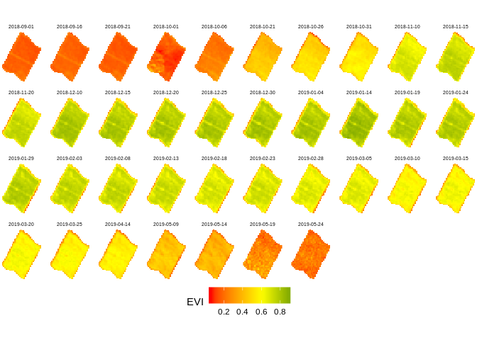

<!-- IMPORTANT: do NOT edit README.Rmd! Edit index.Rmd instead,       -->

<!-- and generate README.Rmd using inst/extdata/code/create_README.sh -->

#  

# Práctica de Integración Mediada

Monitoreo Satelital de Kiwis con Sentinel-2 Agronomía UMayor 2019

## Reseña

La praćtica de integración mediada (PIM) es una actividad parte de la
malla de la carrera de Agronomía de la Universidad Mayor. En la PIM los
estudiantes deben demostrar su capacidad para resolver alguna
problemática relacionada a la agricultura.

En esta PIM se está realizando el monitoreo de kiwis utilizando imágenes
satelitales Sentinel-2 (A/B) además de drones. Para mas información
sobre Sentinel-2 pincha [acá](https://es.wikipedia.org/wiki/Sentinel-2)
o también
[acá](https://sentinel.esa.int/web/sentinel/missions/sentinel-2). El
objetivo de este estudio es encontrar una relación entre la radiación
reflejada por la vegetación en distintas longitudes de onda con
contenido de agua en la hoja y con calidad de kiwis en la cosecha.

Para el procesamiento de los datos se está trabajando con el software
[R](https://www.r-project.org/) en la IDE
[RStudio](https://www.rstudio.com/). El procesamiento de las imágenes
Sentinel-2 (descarga, corrección, transormación) se realiza con el
paquete [`sen2R`](https://github.com/ranghetti/sen2r) desarrollado por
Luigi Ranghetti and Lorenzo Busetto. Para el procesamiento y análisis de
los datos vectoriales ocupamos el paquete [`simple
feature`](https://github.com/r-spatial/sf)(Pebesma 2018a). Los datos
raster con el paquete
[`raster`](https://cran.r-project.org/web/packages/raster/index.html)(Hijmans
2019), en proceso de evolución a
[stars](https://github.com/r-spatial/stars)(Pebesma 2018b). El análisis
de datos con todos los paquetes incluidos en
[tidyverse](https://www.tidyverse.org/)(Wickham 2017).

[Acá](/R) compartimos los script de procesamiento, análisis y descarga.
Los índices vegetacionales entre agosto 2018 a abril 2019 los puedes
descarga en la carpeta [VIs](data/spatial/VIs).

Última actualización: 2019-04-15

Un ejemplo, series de imágenes de NDVI.

``` r
library(stars)
#> Loading required package: abind
#> Loading required package: sf
#> Linking to GEOS 3.6.2, GDAL 2.2.3, PROJ 4.9.3
library(lubridate)
library(viridis)
#> Loading required package: viridisLite
library(ggplot2)

list <- list.files('data/spatial/VIs/NDVI/',full.names=TRUE)
ind <- sort(as.numeric(regmatches(list,regexpr("[0-9]{8}",list))),index.return=TRUE)
new_list <- list[ind$ix]
dates <- ymd(ind$x)
ndvi <- read_stars(new_list,along='time')
ndvi <- st_set_dimensions(ndvi,'time',values= dates)
names(ndvi) <- 'NDVI'
pol <- st_read('data/spatial/vectorial/cuarteles_kiwis.gpkg')
#> Reading layer `cuarteles_kiwis' from data source `/mnt/discoHemera4TB1/UMayor/Agronomia/PIM/2019-I/Kiwis-Sentinel2/data/spatial/vectorial/cuarteles_kiwis.gpkg' using driver `GPKG'
#> Simple feature collection with 1 feature and 2 fields
#> geometry type:  POLYGON
#> dimension:      XY
#> bbox:           xmin: -70.9768 ymin: -34.61518 xmax: -70.97322 ymax: -34.61144
#> epsg (SRID):    4326
#> proj4string:    +proj=longlat +datum=WGS84 +no_defs
pol <- st_transform(pol,"+proj=utm +zone=19 +south +datum=WGS84 +units=m +no_defs +ellps=WGS84 +towgs84=0,0,0 ")

ggplot() + geom_stars(data=ndvi[pol]*10e-5) +
  coord_equal() +
  facet_wrap(~time,ncol=10) +
  theme_void() +
  scale_fill_gradient2(low="red", mid="yellow",high="darkgreen",midpoint=0.5,na.value="transparent") +
  theme(strip.text = element_text(size=5),
        legend.position = 'bottom')
```

<!-- -->

Serie de tiempo de valores de NDVI promedio en el
cuartel

``` r
data <- data.frame(dates=as.POSIXct(dates),NDVI=st_apply(ndvi[pol],3,FUN='mean',na.rm=TRUE)$NDVI)

ggplot(data,aes(dates,NDVI*10e-5)) + 
  geom_point() + geom_smooth(span=0.2)+
  scale_x_datetime(date_breaks='1 month',date_label ='%d-%m')+
  labs(y='NDVI')+
  theme_minimal()
#> `geom_smooth()` using method = 'loess' and formula 'y ~ x'
```

<!-- -->

Ranghetti, L. and Busetto, L. (2019). *sen2r: an R toolbox to find,
download and preprocess Sentinel-2 data*. R package version 1.0.0. DOI:
[10.5281/zenodo.1240384](https://dx.doi.org/10.5281/zenodo.1240384).
URL: <http://sen2r.ranghetti.info>.

<div id="refs" class="references">

<div id="ref-Hijmans2019">

Hijmans, Robert J. 2019. *Raster: Geographic Data Analysis and
Modeling*. <https://CRAN.R-project.org/package=raster>.

</div>

<div id="ref-Pebesma2018">

Pebesma, Edzer. 2018a. “Simple Features for R: Standardized Support for
Spatial Vector Data.” *The R Journal*.
<https://journal.r-project.org/archive/2018/RJ-2018-009/index.html>.

</div>

<div id="ref-Pebesma2018b">

———. 2018b. *stars: Scalable, Spatiotemporal Tidy Arrays*.
<https://CRAN.R-project.org/package=stars>.

</div>

<div id="ref-Wickham2017">

Wickham, Hadley. 2017. *Tidyverse: Easily Install and Load the
’Tidyverse’*. <https://CRAN.R-project.org/package=tidyverse>.

</div>

</div>
